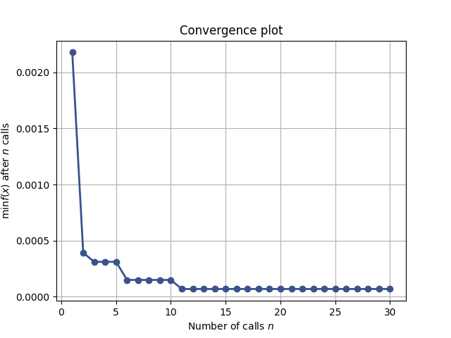
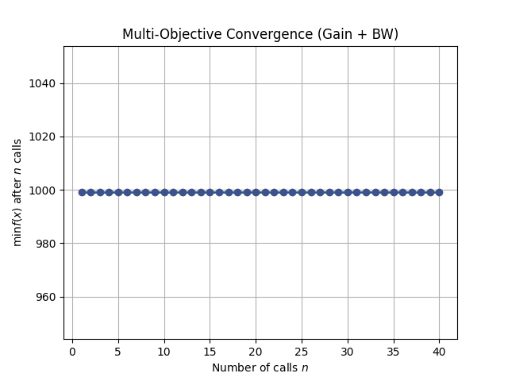

# Analog-AI-Sizer 🚀

An automated analog circuit sizing framework integrating **AI (Bayesian Optimization)** with the **Open-Source Sky130 PDK**. This tool provides a professional **GUI interface** to streamline the analog design flow.

## 📖 Overview
Analog circuit sizing is traditionally a manual, iterative process. This project leverages **Machine Learning** to explore the design space and find optimal transistor dimensions ($W, L, nf$) to meet specific performance targets (Specs).

## 🛠 Features (Currently Available)

### 1. Single MOSFET Optimizer
- **Target:** Precise Drain Current ($I_d$) matching.
- **Parameters:** Optimizes $W$, $L$, and $nf$ (Number of Fingers).
- **Status:** ✅ Fully Functional.

### 2. Differential Pair Optimizer (Passive Load)
- **Circuit:** Differential pair with resistive load.
- **Target:** Optimize for **Gain (Av)** and **Bandwidth (BW)** simultaneously.
- **AI Task:** Multi-objective optimization using weighted cost functions.
- **Status:** ✅ Fully Functional.

### 3. Modern GUI Interface
- Built with **CustomTkinter** for a professional EDA tool experience.
- Real-time log synchronization between the AI engine and UI.
- Automated convergence plot visualization.

## 📊 Result: Optimization Convergence
The AI successfully explores the high-dimensional design space. Below is the error convergence plot:

## 🏗 Tech Stack
- **PDK:** SkyWater 130nm (Sky130) via Volare
- **Simulator:** Ngspice
- **AI Engine:** Scikit-optimize (Bayesian Optimization)
- **GUI:** CustomTkinter / Pillow

> ⚠️ **Note on Model Library:** Users must manually update the `lib_path` in `simulator.py` to point to their local Sky130 PDK `.lib.spice` file.

## 🛤 Future Development Roadmap

### 1. Active Load Support
- Transition from resistive loads to **Active Current Mirror loads** for significantly higher gain.

### 2. Automated PVT Corner Analysis (Phase 2)
- Ensure design robustness across **Process**, **Voltage**, and **Temperature** (-40°C to 125°C).

### 3. Operational Amplifier (Op-Amp) Design (Phase 3)
- Full Two-stage Miller Compensation Op-Amp optimization.

### 4. Layout-Aware Optimization
- Integration with **KLayout** for PEX (Parasitic Extraction) back-annotation.

## 🚀 How to Run
1. Ensure Ngspice and Volare (Sky130) are installed.
2. `pip install -r requirements.txt`
3. `python3 gui_app.py`